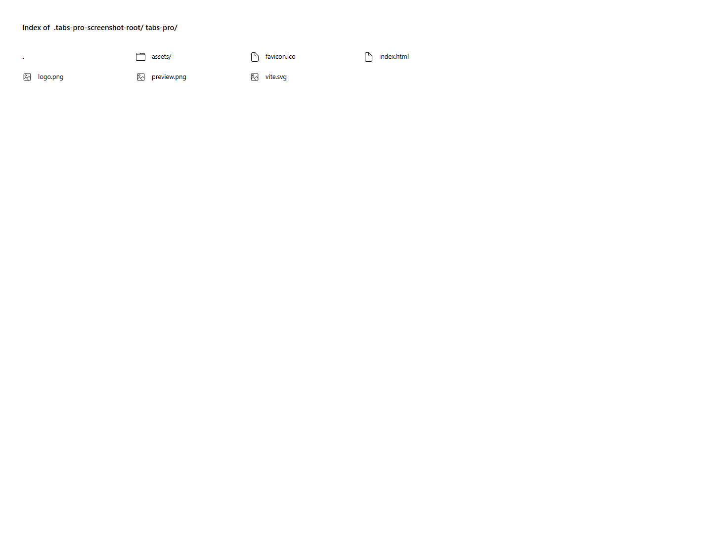

# Tabs Pro

Tabs Pro is a reusable React tabs component with accessible keyboard navigation, closable tabs and persistent note content. It is a small reference project for dashboards, documentation and settings interfaces.

## Features

- Keyboard navigation with arrow keys, Home and End
- Add and close note tabs
- Local storage persistence with reset support
- Responsive tab strip with clear active states
- GitHub Pages deployment with Vite
- Floating go-to-top control with smooth scrolling

## Tech stack

React, Vite, styled-components, react-icons and react-toastify.

## Run locally

    git clone https://github.com/a2rp/tabs-pro.git
    cd tabs-pro
    npm install
    npm run dev

## Deployment

Live: [https://a2rp.github.io/tabs-pro/](https://a2rp.github.io/tabs-pro/)

Deploy with:

    npm run deploy

## Links

- Portfolio: [https://www.ashishranjan.net/](https://www.ashishranjan.net/)
- GitHub: [https://github.com/a2rp](https://github.com/a2rp)
- CodePen: [https://codepen.io/ash1198](https://codepen.io/ash1198)
- LinkedIn: [https://www.linkedin.com/in/aashishranjan](https://www.linkedin.com/in/aashishranjan)
- Facebook: [https://www.facebook.com/theash.ashish/](https://www.facebook.com/theash.ashish/)
- YouTube: [https://www.youtube.com/@ashishranjan-ashz?sub_confirmation=1](https://www.youtube.com/@ashishranjan-ashz?sub_confirmation=1)
- Email: [ash.ranjan09@gmail.com](mailto:ash.ranjan09@gmail.com)

## Support

- Support: [https://a2rp-donation-page.netlify.app/](https://a2rp-donation-page.netlify.app/)
- Buy Me a Coffee: [https://buymeacoffee.com/a2rp](https://buymeacoffee.com/a2rp)
- Patreon: [https://www.patreon.com/a2rp](https://www.patreon.com/a2rp)
